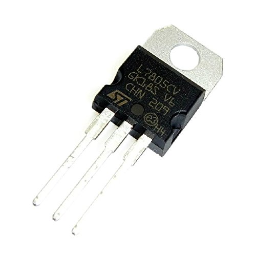
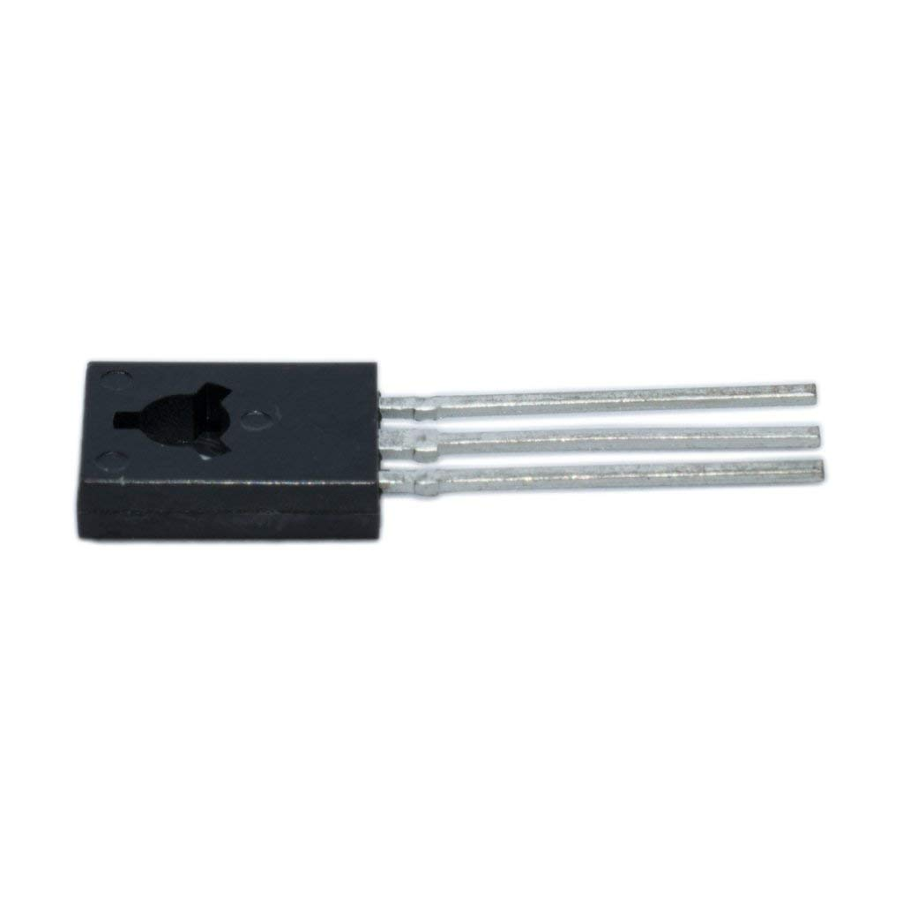

# Laser Sprinting Gates

This Laser Sprinting Gate (LSG) project uses two Arduino Nanos and an Arduino Uno linked together via 
nRF24l01 modules. 

<em>The Laser Speed Gates - Indoors.</em>

# Table of contents
1. [Overview](#overview)
2. [Remote control](#rem-cont)
3. [Detectors](#detectors)
4. [Dependencies](#Dependencies)
5. [Folder structure](#Folder-Structure)
6. [Contributing](#Contributing)
7. [Code of Conduct](#Code-of-Conduct)

## Overview 

The electronics fits in their own project boxes, which are 3-d printed.

There are two boxes for the laser diodes, two for the detectors / transceivers; and one for the remote control.

You set up the tripods, point the lasers into the detectors a measured distance apart and switch everything on.

Then press the pushbutton on the remote control. The LCD will say "Ready" if the laser gates are closed, or will tell you to "Close gates" if the lasers are not directed on the photodiodes.

When you run through both gates the remote control will display your time on the LCD in <b>min:sec:ms</b> format.

## Remote Control 
The remote control is operated as a "master" to two "slaves" (the detectors). When the reset button is pressed a signal is sent to the two slaves, which send a return packet using the AckPayload protocol. The signal from the master includes the time in milli-seconds when the signal is sent (which is the reference time).

The information in the return packet includes information on whether the gates are closed (i.e. laser pointing at the photodiode); the reference time; and the time at which the gate was first opened (laser beam broken) after the reset signal. If both gates have been opened the difference between these two times is the time taken. This time is then printed to the remote control LCD.

The LCD uses the LiquidCrystal library and the following code to interface to it:

<code>
LiquidCrystal lcd(1,0,5,4,3,2);
</code>

However, this may change so that the master uses pin 2 or 3 for the reset button (as an interupt can then be attached).

The remote control enclosure is 3-D printed (designs are part of this repository).

<em>The remote control consists of an Arduino Uno; nRF24L01 transceiver module; reset button; and LCD screen.</em>

Upload the master.ino to the arduino UNO.

## Detectors 
The detectors both use an Arduino Nano; nRF24L01 modules. The pins used on the Nano (same for the Uno board used in the remote control) are:

<table style="width:100%">
  <tr> 
    <td>
    Arduino Pin  
    </td>
    <td>
    nRF24L01 Pin
    </td>
  </tr>
  <tr> 
    <td>
    3.3V  
    </td>
    <td>
    VCC
    </td>
  </tr>
  <tr> 
    <td>
    GND  
    </td>
    <td>
    GND
    </td>
  </tr>
  <tr> 
    <td>
    8  
    </td>
    <td>
    CSN
    </td>
  </tr>
  <tr> 
    <td>
    7  
    </td>
    <td>
    CE
    </td>
  </tr>
  <tr> 
    <td>
    13  
    </td>
    <td>
    SCK
    </td>
  </tr>
  <tr> 
    <td>
    11  
    </td>
    <td>
    MOSI
    </td>
  </tr>
  <tr> 
    <td>
    12  
    </td>
    <td>
    MISO
    </td>
  </tr>
</table>

There is also an interface to a photodiode circuit (a photodiode, two resistors and a p-type transistor), which goes to pin 2.

The photodiode circuit used is taken from Figure 3, using circuit A, with RBE=1 kohm, RL=10 kohm and a BD140 (p-type) transistor [see here](reference/Photodiode_circuit.pdf).

<em>Two detector boards being constructed.</em>

Upload the slaves.ino to the Arduino Nanos: one should have 

<code>thisSlaveAddress set to RxAAA</code> 

and the other

<code>thisSlaveAddress set to RxAAB</code> 

(change the address on approximate line 12 / 13 or the slaves.ino file).

## Dependencies 

I needed to install two libraries for the Arduino for communication. The libraries are nRF24L01 and RF24.

## Folder structure 

The repository structure is now discussed

### Directory layout

    .                           
    ├── arduino               # code for the Arduino
    ├── images                # image files for the project
    ├── links                 # some links that I used 
    ├── openSCAD              # Design files in openSCAD
    ├── README.md             # This readme
    └── reference			  # contains reference documents
    
----------

**REQUIRED PARTS**

In order to **make your own Laser Sprinting Gates**, you may use the **part list below** to acquire all the components **on your own**.

<table style="width:100%">
  <tr>
    <td>
    Arduino Uno  
    </td>
    <td><a href="https://www.amazon.co.uk/Arduino-ATMega16U2-ATMEGA328P-Microcontroller-Official/dp/B077JMX1NP/ref=sr_1_9?s=computers&ie=UTF8&qid=1531612973&sr=1-9&keywords=arduino+uno" target="_blank"> Amazon </a></td> 
    <td>£20</td>
  </tr>

  <tr>
    <td>
    Arduino Nano A000005 Board V3 x2 
    </td>
    <td><a href="https://www.rapidonline.com/arduino-nano-a000005-board-v3-73-4448" target="_blank"> Rapid Electronics </a></td> 
    <td>£15.60 x 2 = £31.20</td>
  </tr>

  <tr>
    <td>
    Strip board  
    </td>
    <td><a href="https://www.amazon.co.uk/gp/product/B072PS947V/ref=oh_aui_detailpage_o09_s00?ie=UTF8&psc=1" target="_blank"> Amazon </a></td> 
    <td>£10</td>
  </tr>

  
  <tr>
    <td>
    Slide switch  
    </td>
    <td><a href="https://www.amazon.co.uk/gp/product/B008R50AA0/ref=oh_aui_detailpage_o07_s00?ie=UTF8&psc=1" target="_blank"> Amazon </a></td> 
    <td>£0.15</td>
  </tr>
  
  <tr>
    <td>
    PCB Header Connectors  
    </td>
    <td><a href="https://www.amazon.co.uk/gp/product/B01M69EA9O/ref=oh_aui_detailpage_o03_s00?ie=UTF8&psc=1" target="_blank"> Amazon </a></td> 
    <td>£5</td>
  </tr>
  
  
  <tr>
    <td>
    Affix Pozi Pan Head Stainless Steel Screws M2.5 12mm   
    </td>
    <td><a href="https://www.rapidonline.com/Affix-Pozi-Pan-Head-Stainless-Steel-Screws-M2-5-12mm-Pack-Of-100-33-4205?utm_source=AffWin&utm_medium=Affiliate&awc=1799_1531559350_6bf53c34df454762e1e501399281f666" target="_blank"> Rapid online </a></td> 
    <td>£3.40</td>
  </tr>
  
  <tr>
    <td>
    Affix Stainless Steel Plain Washers M2.5   
    </td>
    <td><a href="https://www.rapidonline.com/affix-stainless-steel-plain-washers-m2-5-pack-of-100-33-4315" target="_blank"> Rapid online </a></td> 
    <td>£1</td>
  </tr>
  
  <tr>
    <td>
    M2.5 nuts  
    </td>
    <td><a href="https://www.rapidonline.com/tr-fastenings-w-m2-5-hfst-tc1-steel-full-nuts-metric-m2-5-box-of-100-33-6589" target="_blank"> Rapid online </a></td> 
    <td>£1.20</td>
  </tr>
  
  
  <tr>
    <td>
    10 Metres 4mm Brown Sleeving On A Roll.  
    </td>
    <td><a href="https://www.amazon.co.uk/gp/product/B006I1K7NU/ref=oh_aui_search_detailpage?ie=UTF8&psc=1" target="_blank"> Amazon </a></td> 
    <td>£2.99</td>
  </tr>
  
  <tr>
    <td>
    LED  
    </td>
    <td><a href="https://www.amazon.co.uk/dp/B00CM5DEZO/ref=sxts_kp_lp_3?pf_rd_m=A3P5ROKL5A1OLE&pf_rd_p=fb7bbe16-4a21-4f5a-938c-e2ac1558fbcd&pd_rd_wg=WvUCM&pf_rd_r=G8N068HW8BDFM7DW6CEY&pf_rd_s=desktop-sx-top-slot&pf_rd_t=301&pd_rd_i=B00CM5DEZO&pd_rd_w=RxAWr&pf_rd_i=leds&pd_rd_r=ad3598ab-370e-4f6e-a6e7-f164199962c9&ie=UTF8&qid=1535959984&sr=3" target="_blank"> Amazon </a></td> 
    <td>£0.65</td>
  </tr>
  
  
  	
  <tr>
    <td>
    Linear regulator  
    </td>
    <td><a href="https://www.amazon.co.uk/LM338T-Adjustable-Positive-Voltage-Regulator/dp/B07F2YMXTR/ref=sr_1_cc_1?s=aps&ie=UTF8&qid=1531560057&sr=1-1-catcorr&keywords=lm338" target="_blank"> Amazon </a></td> 
    <td>£3</td>
  </tr>
  
	
  <tr>
    <td>
    nRF24L01 module  
    </td>
    <td><a href="https://www.amazon.co.uk/gp/product/B06WD17WLS/ref=oh_aui_detailpage_o08_s00?ie=UTF8&psc=1"> Amazon </a></td> 
    <td>£13.99</td>
  </tr>
  
	
  <tr>
    <td>
    photodiodes  
    </td>
    <td><a href="https://www.amazon.co.uk/gp/product/B00M1PMHO4/ref=oh_aui_detailpage_o08_s01?ie=UTF8&psc=1"> Amazon </a></td> 
    <td>£2.99</td>
  </tr>
  
  <tr>
    <td>
    Laser diodes  
    </td>
    <td><a href="https://www.amazon.co.uk/gp/product/B0798PXGTS/ref=oh_aui_detailpage_o08_s02?ie=UTF8&psc=1"> Amazon </a></td> 
    <td>£3.99</td>
  </tr>
  
	
  <tr>
    <td>
    LCD  
    </td>
    <td><a href="https://www.rapidonline.com/winstar-wh1602b-tmi-jt-16x2-lcd-display-blue-negative-mode-white-led-backlight-57-2228"> Rapid electronics </a></td> 
    <td>£6.40</td>
  </tr>
  
	
  <tr>
    <td>
    Pushbutton switch  
    </td>
    <td><a href="https://www.amazon.co.uk/gp/product/B00KHV7QFE/ref=oh_aui_detailpage_o01_s00?ie=UTF8&psc=1" target="_blank"> Amazon </a></td> 
    <td>£2.22</td>
  </tr>
	
  <tr>
    <td>
    9V battery clip connector  
    </td>
    <td><a href="https://www.amazon.co.uk/gp/product/B00HG8BJWM/ref=oh_aui_search_detailpage?ie=UTF8&psc=1" target="_blank"> Amazon </a></td> 
    <td>£0.87</td>
  </tr>
	
  <tr>
    <td>
    M2x50mm screws (cut to size)  
    </td>
    <td><a href="https://www.amazon.co.uk/Stainless-Steel-Phillips-Round-Screws/dp/B01EZZFBDG/ref=sr_1_2?ie=UTF8&qid=1540222929&sr=8-2&keywords=m2+x+50mm+304" target="_blank"> Amazon </a></td> 
    <td>£14.35</td>
  </tr>
	
  <tr>
    <td>
    Tripod Socket  
    </td>
    <td><a href="https://www.amazon.co.uk/Hillman-Group-2511-4-20-13-Pack/dp/B00HYLZ33W/ref=sr_1_1?s=electronics&ie=UTF8&qid=1516292925&sr=8-1&keywords=Brad+Hole+Tee+Nuts"> Amazon </a></td> 
    <td>£10</td>
  </tr>
	
  <tr>
    <td>
    m2 counter sunk  
    </td>
    <td><a href="https://www.ettinger.de/en/product/0112138"> Ettinger or similar supplier </a></td> 
    <td>£3</td>
  </tr>
	
  <tr>
    <td>
    Hex Standoff Male/Female BSB-2010E, 10mm, M2 x M2  
    </td>
    <td><a href="https://uk.rs-online.com/web/p/standoffs/6643035/?relevancy-data=636F3D3126696E3D4931384E525353746F636B4E756D626572266C753D656E266D6D3D6D61746368616C6C26706D3D5E2828282872737C5253295B205D3F293F285C647B337D5B5C2D5C735D3F5C647B332C347D5B705061415D3F29297C283235285C647B387D7C5C647B317D5C2D5C647B377D2929292426706F3D3126736E3D592673723D2673743D52535F53544F434B5F4E554D4245522677633D4E4F4E45267573743D36363433303335267374613D3636343330333526&searchHistory=%7B%22enabled%22%3Afalse%7D"> RS </a></td> 
    <td>£7</td>
  </tr>
	
		
	
  <tr>
    <td>
    Hexagon Nut D934 M2  
    </td>
    <td><a href="https://www.ettinger.de/en/product/0210011"> Ettinger or similar supplier </a></td> 
    <td>£2</td>
  </tr>
	
  <tr>
    <td>
    BD140  
    </td>
    <td><a href="https://www.amazon.co.uk/BD140-10-CDI-Transistor-Bipolar-1-5A-TO126/dp/B07HR3BWLZ/ref=sr_1_2?ie=UTF8&qid=1540224481&sr=8-2&keywords=bd140"> Amazon </a></td> 
    <td>£3.50</td>
  </tr>
	
		
	
		
</table>

Plus: 
<ul>
<li> Resistors: 1k &Omega; ;2x220 &Omega; ;10 k &Omega;
<li> some other wire 22awg for low current connections;  
<li> Heat shrink for 22awg wire.
<li> 4 x 9V batteries
<li> 4x tripod stands. Good quality is obviously better, but you can get them quite cheap of ebay see <a href="https://www.ebay.co.uk/itm/Stretchable-Camera-Tripod-Stand-Mount-Holder-for-iPhone-8-7-Plus-Samsung-Phone/362434198720?_trkparms=aid%3D111001%26algo%3DREC.SEED%26ao%3D1%26asc%3D20160908105057%26meid%3Dc3250a39280f44349835c781bb6ad9ca%26pid%3D100675%26rk%3D7%26rkt%3D15%26sd%3D391719322779%26itm%3D362434198720&_trksid=p2481888.c100675.m4236&_trkparms=pageci%3A2dd86933-d613-11e8-b9b5-74dbd1801eb4%7Cparentrq%3A9c7ed44a1660ab4dc137dc5cfff6aee7%7Ciid%3A1"> here </a>
<li> 3-d printing materials:
	<ul>
	<li> PLA plastic
	</ul>
</ul>

## Contributing

Contributions to this Laser Sprinting Gate project are more than welcome. I am sure there are many improvements that could be made. I am very happy to discuss ideas for improvement and how to add/remove features.  

Please use the issue tracker at https://github.com/maul1609/laser-sprinting-gates/issues if you want to notify me of an issue or need support. If you want to contribute, please either create an issue or make a pull request. Alternatively, come and see me in Manchester and/or lets meet for a coffee and a chat!

## Code of Conduct

To be arranged.